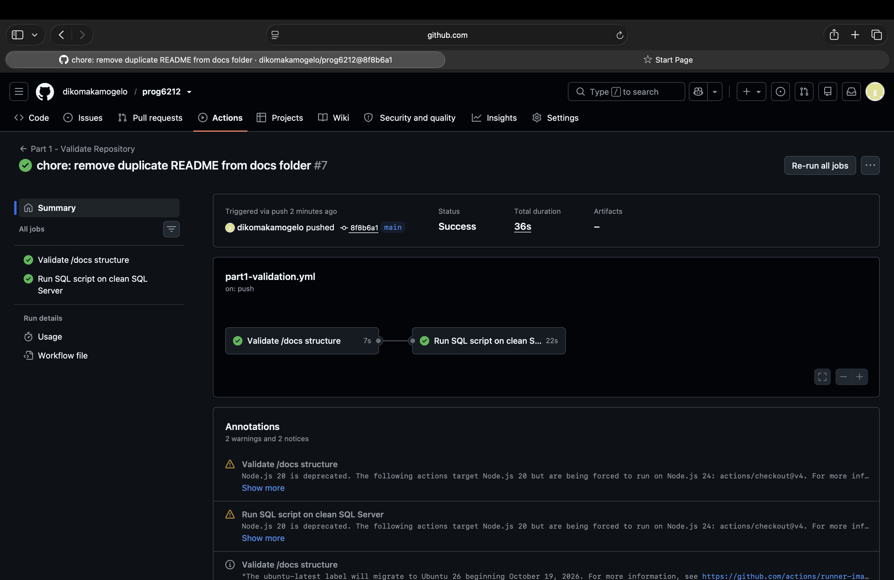

# RaceDay 🏃‍♀️🚶🚴

**RaceDay** is a full-stack, web-based event management system for the South African road running, walking and cycling community. It replaces paper registration forms, spreadsheets and scattered WhatsApp groups with one platform. Organisers run their events there, and Participants find, enter and track races there.

| | |
|---|---|
| **Module** | PROG6212 – Programming 2B |
| **Student** | _Kamo Dikoma_ – _ST10452126_ |
| **Current stage** | Part 1 – System Planning and Database |

---

## ✅ CI/CD – Green Build



The GitHub Actions workflow (`.github/workflows/part1-validation.yml`) runs on every push to `main` and has two jobs:
1. **Validate /docs structure** checks that the README, `/docs` folder, ERD image, endpoint plan (with all six columns) and SQL script exist, and that the script has at least 6 tables plus seed data.
2. **Run SQL script on clean SQL Server** starts a fresh SQL Server 2022 container and runs `RaceDay_Database.sql`. This proves the script executes without errors on a clean instance.

---

## 👥 User Roles

| Role | What they can do |
|---|---|
| **Organiser** | Create, edit and delete their own events · define age or distance categories for each event · view all enrolments for their events · capture participants' finish times and positions |
| **Participant** | Create an account · browse and view events and categories · enter an event by selecting a category · view their own enrolments · track their personal results and performance history |

A user picks their role when they register. Role-based access will be enforced at the API level in Part 2 and reflected in the MVC interface in Part 3.

---

## 📁 Repository Structure

```
RaceDay/
├── .github/
│   └── workflows/
│       └── part1-validation.yml   # CI: structure check + SQL script test
├── docs/
│   ├── RaceDay_ERD.png            # Entity Relationship Diagram
│   ├── erd.dot                    # Editable ERD source (Graphviz)
│   ├── API_Endpoint_Plan.md       # Full API endpoint specification
│   ├── RaceDay_Database.sql       # Schema + seed data (SQL Server)
│   └── images/
│       └── ci-green-build.png     # CI screenshot used in this README
└── README.md
```

---

## ⚙️ Setup – Running the Database Script

**Requirements:** SQL Server (Express or Developer edition) and SQL Server Management Studio (SSMS).

1. Clone the repository:
   ```bash
   git clone <your-repo-url>
   ```
2. Open **SSMS** and connect to your local SQL Server instance (e.g. `localhost` or `.\SQLEXPRESS`).
3. Go to **File → Open → File…** and select `docs/RaceDay_Database.sql`.
4. Press **F5** (Execute). The script will:
   - drop `RaceDayDB` if it already exists and recreate it,
   - create all 7 tables with primary keys, foreign keys and constraints,
   - insert the seed data,
   - run three verification queries that show users, events and enrolments/results.
5. Refresh **Databases** in Object Explorer to see `RaceDayDB`.

**Demo login (for Part 2):** all seeded users have the password `RaceDay@2026`. It is stored as a BCrypt hash, never as plain text.

| Name | Email | Role |
|---|---|---|
| Thandiwe Mokoena | thandiwe.mokoena@jozirunners.co.za | Organiser |
| Pieter van Wyk | pieter.vanwyk@capecycling.co.za | Organiser |
| Sipho Ndlovu | sipho.ndlovu@gmail.com | Participant |
| Ayesha Patel | ayesha.patel@outlook.com | Participant |
| Lerato Khumalo | lerato.khumalo@yahoo.com | Participant |
| Johan Botha | johan.botha@gmail.com | Participant |

---

## 🗂️ Database Design Decisions

The design has **7 entities**: `Roles`, `Users`, `EventTypes`, `Events`, `Categories`, `Enrolments`, `Results`.

- **One `Users` table with a `Roles` lookup.** Organisers and Participants share the same login fields, so one table avoids duplication. The `RoleId` foreign key tells them apart. A lookup table keeps role names consistent and lets the API reject any role that is not in the table during registration.
- **`EventTypes` lookup (Run, Walk, Cycle).** Keeps event types consistent and avoids spelling variations like "cycling" vs "Cycle".
- **Many-to-many via `Enrolments`.** One Participant can enter many events and one event has many Participants. `Enrolments` is the associative entity that resolves this M:N relationship and also records the chosen category.
- **Category must belong to the same event.** `Enrolments` has a composite foreign key `(CategoryId, EventId)` → `Categories(CategoryId, EventId)`. This means the database itself rejects an enrolment whose category belongs to a different event.
- **One enrolment per participant per event.** Enforced by `UNIQUE (ParticipantId, EventId)`.
- **`Results` linked to `Enrolments` (1 : 0..1).** A result can only exist for someone who actually enrolled, and each enrolment has at most one result (`UNIQUE (EnrolmentId)`). Upcoming events simply have no result yet.
- **Delete behaviour.** Deleting an event cascades to its categories. Enrolment foreign keys use `NO ACTION` to avoid SQL Server's "multiple cascade paths" error. The API will instead return `409 Conflict` if an Organiser tries to delete an event or category that already has enrolments, which protects participants' records.
- **Planning ahead for Part 3.** `Latitude`/`Longitude` on `Events` support the live weather feature, and `RouteImageUrl` will store the Azure Blob Storage URL of the route map.
- **Constraints used:** `NOT NULL`, `UNIQUE`, `DEFAULT` (timestamps, enrolment status) and `CHECK` (positive distance, valid category type, `MinAge ≤ MaxAge`, positive position, valid status).

### Deviations between ERD and SQL script
None. The SQL script matches the ERD exactly.

---

## 🔌 API Endpoint Plan

The full plan (26 endpoints with method, route, description, role, request body and responses) is in [`docs/API_Endpoint_Plan.md`](docs/API_Endpoint_Plan.md). It covers Authentication, User Profile, Events, Categories, Event Enrolments and Results.

---

## 🤖 AI Usage Disclosure

AI was used during planning to help draft the initial ERD structure, endpoint plan and SQL script. I modified all of it, and the design decisions above reflect my own understanding.
